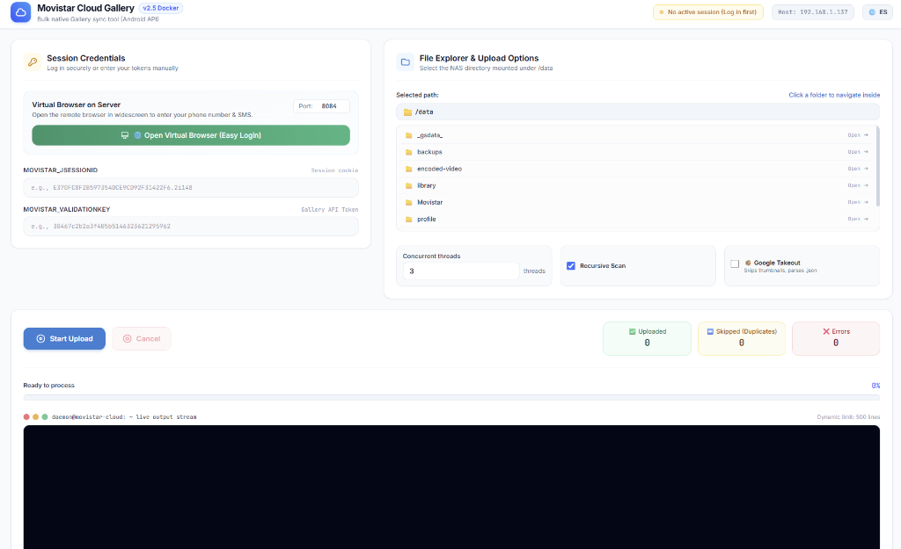

# Movistar Cloud Gallery Uploader ☁️

[](https://hub.docker.com/r/uniextra/movistar-cloud)
[](https://opensource.org/licenses/MIT)

A comprehensive, robust, and Dockerized solution to automatically bulk-upload photos and videos to **Movistar Cloud España**, fully replicating the behavior of the native Android App (pure Gallery objects, bypassing the virtual file system).



---

## 🌟 Key Features

### 📸 Native Gallery Behavior
Reverse-engineered the exact API call used by the Movistar Android app. Uploaded media behaves purely as native "Gallery" items (omitting the `folderid`). They won't clutter the "Files/Ficheros" view and cannot be accidentally deleted from there.

### 🌐 Modern Responsive Web UI (Bilingual)
- **Automatic Language Detection**: Loads in **Spanish** or **English** based on your browser/OS preferences, with an instant manual toggle (`🌐 ES/EN`).
- **Expansive Widescreen Virtual Desktop (1600x900)**: Launches an isolated Chromium session running on Xvfb + noVNC directly in an expansive modal. Easily enter your phone number and SMS code; tokens (`JSESSIONID` and `VALIDATIONKEY`) are automatically intercepted, saved, and the modal auto-closes.
- **Interactive File Explorer**: Visually browse `/data` folders on your NAS or server.
- **Dynamic Metrics & Dark Terminal**: Real-time KPI counters (✅ Uploaded, ⏭️ Skipped/Duplicates, ❌ Errors) with animated progress bar and dark-mode log stream bounded to 500 lines.

### 📦 Google Takeout Mode
A lifesaver for migrating from Google Photos. When enabled:
- Automatically filters out junk thumbnails (`<40KB` or thumbnail patterns).
- Reads the accompanying `*.json` sidecar files to extract the exact `photoTakenTime.timestamp`. This avoids the common issue where all exported photos receive today's upload timestamp.

### 🧠 Smart Duplicate Detection
Queries the cloud gallery catalog prior to uploading, matching by exact filename and size. Resuming cancelled uploads is instantaneous and incurs zero unnecessary bandwidth.

### ⚡ Robust Architecture & Self-Healing
- **Multi-threaded uploads**: Configurable parallel workers (1–10 threads).
- **Self-Healing X11/VNC**: Services (`Xvfb`, `fluxbox`, `x11vnc`, `websockify`) auto-recover and self-initialize from Python even if run under custom container overrides.
- **401 Hard-Fail**: Aborts immediately if session cookies expire mid-upload, preventing infinite error loops.

---

## 🐳 Docker Deployment

### Using Docker CLI

```bash
docker run -d \
  --name movistar-uploader \
  -p 5000:5000 \
  -p 8084:8084 \
  -v /ruta/a/tus/fotos:/data \
  uniextra/movistar-cloud:latest
```

### Using Docker Compose

```yaml
version: '3.8'

services:
  movistar-uploader:
    image: uniextra/movistar-cloud:latest
    container_name: movistar-uploader
    restart: unless-stopped
    ports:
      - "5000:5000"   # Web Dashboard
      - "8084:8084"   # Virtual Browser (VNC)
    volumes:
      - /path/to/your/photos:/data
```

---

## 📖 Usage Guide

1. Open your browser at `http://SERVER_IP:5000`.
2. Click **🌐 Open Virtual Browser (Login)**.
3. Enter your phone number and SMS code inside the widescreen Movistar Cloud window.
4. Once authenticated, the window closes automatically, filling your session keys.
5. Select your target folder under `/data`, pick your preferred settings (Threads, Recursive, Google Takeout), and hit **Start Upload**!

---

## ⚠️ Disclaimer
This is an educational, reverse-engineered project. It is not affiliated with, endorsed by, or maintained by Telefónica or Movistar. Use at your own risk.
